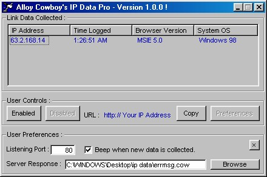



## IP Data Pro

### Description

This application is an update on Plasma's "IP Stealer Pro" submission. I really liked his concept, but can't stand to use un-commented, un-indented code. I cleaned up the source and interface, as well as made some code changes to increase reliability and functionability. I'm planning on coding some more advanced "cowboy response scripts" for this app when I have the time, and I will post them when finished. If you come up with any new scripts or improvements, please e-mail me or post a comment. Thanx and enjoy ! Later - Alloy Cowboy -
 
### More Info
 
You will need winsock.ocx to use this app.

Familiarity with the MS winsock control would be helpful.

Remote host IP address, time logged, browser version, operating system version.

             |
---                |---
**Submitted On**   |2000-04-21 01:44:52
**By**             |[Alloy Cowboy](https://github.com/Planet-Source-Code/PSCIndex/blob/master/ByAuthor/alloy-cowboy.md)
**Level**          |Intermediate
**User Rating**    |3.7 (11 globes from 3 users)
**Compatibility**  |VB 5\.0, VB 6\.0
**Category**       |[Complete Applications](https://github.com/Planet-Source-Code/PSCIndex/blob/master/ByCategory/complete-applications__1-27.md)
**World**          |[Visual Basic](https://github.com/Planet-Source-Code/PSCIndex/blob/master/ByWorld/visual-basic.md)
**Archive File**   |[CODE\_UPLOAD50104212000\.zip](https://github.com/Planet-Source-Code/alloy-cowboy-ip-data-pro__1-7435/archive/master.zip)

